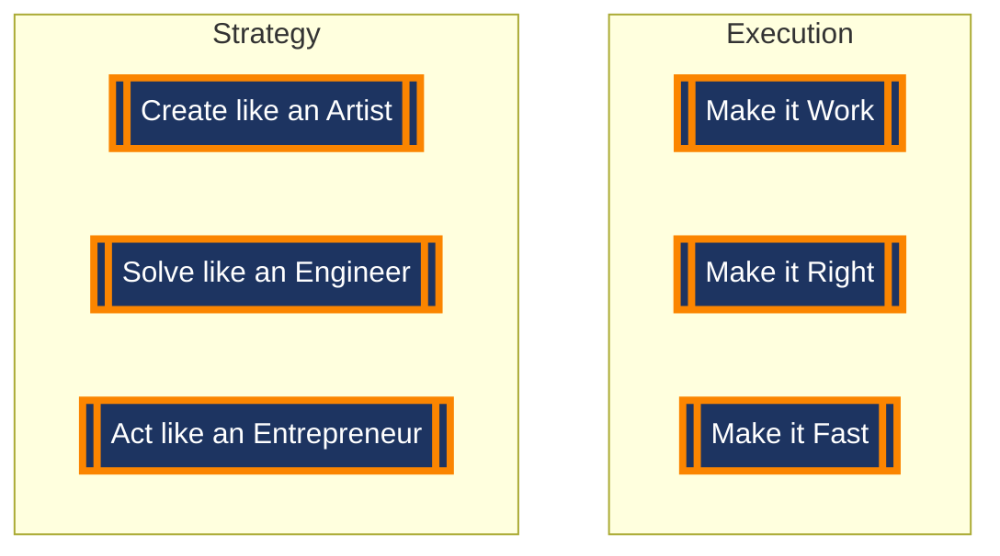

```mermaid
  flowchart TB
    
    subgraph Execution
    b1[[Make it Work]]
    b2[[Make it Right]]
    b3[[Make it Fast]]
    end
    style b1 fill:#1d3461,stroke:#fb8500,stroke-width:4px,color:#fff
    style b2 fill:#1d3461,stroke:#fb8500,stroke-width:4px,color:#fff
    style b3 fill:#1d3461,stroke:#fb8500,stroke-width:4px,color:#fff
    
    subgraph Strategy
    c1[[Create like an Artist]]
    c2[[Solve like an Engineer]]
    c3[[Act like an Entrepreneur]]
    end
    style c1 fill:#1d3461,stroke:#fb8500,stroke-width:4px,color:#fff
    style c2 fill:#1d3461,stroke:#fb8500,stroke-width:4px,color:#fff
    style c3 fill:#1d3461,stroke:#fb8500,stroke-width:4px,color:#fff
    
    
```
